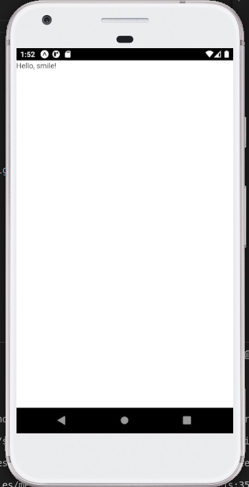
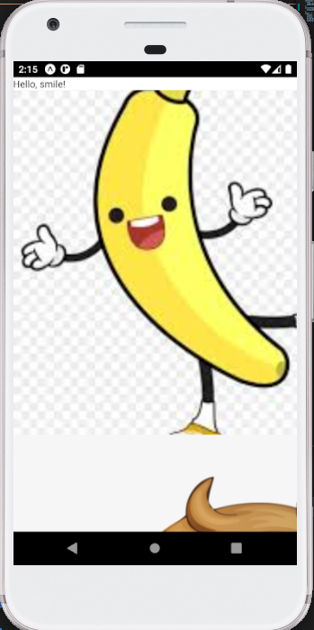
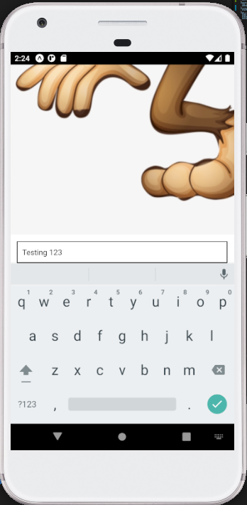

# React Native - Components and Layout

## Brief
In this lesson, learners should generate a new RN Project by using the familiar command `expo init CompAndLayoutApp`.

## Part 1 - Simple Core Components

We shall start trying out the following components:

- View
- Text

What is a `View` component?

> The most fundamental component for building a UI, View is a container that supports layout with flexbox, style, some touch handling, and accessibility controls. View maps directly to the native view equivalent on whatever platform React Native is running on, whether that is a UIView, android.view, etc.

What is a `Text` component?

> A React component for displaying text. Text supports nesting, styling, and touch handling.

### Step 1: Import components from the "react-native" package.

```js
import { Text, View } from "react-native";
```

### Step 2: Render components by returning the JSX.

```js
return (
  <View>
    <Text>Hello, smile!</Text>
  </View>
);
```

Result:



In case you find it's font too tiny, use inline style to increase it's font size: `<Text style={{fontSize:50}}>Hello, smile!</Text>`

## Part 2 - Image Component

Let's continue to try another component:

- Image

What is an Image component?

> A React component for displaying different types of images, including network images, static resources, temporary local images, and images from local disk, such as the camera roll.

### Step 1: Include Image component in the destructor syntax importing "react-native".

```js
import { Text, View, Image } from "react-native";
```

### Step 2: Add a local image

Copy `monkey.png` from `./assets/images/monkey.png` into your project asset folder `./CompAndLayoutApp/assets/monkey.png`.

Import the image as a variable:

```js
import monkeyPng from "./assets/monkey.png";
```

Return Image component in JSX:

```js
return (
  <View>
    <Text>Hello, smile!</Text>
    <Image source={monkeyPng}></Image> // here
  </View>
);
```

### Step 3: Add a network image

> Note that for network and data images, you will need to manually specify the dimensions of your image!

Add another Image component in the return block:

```js
return (
  <View>
    <Text>Hello, smile!</Text>
    <Image
      style={styles.image}
      source={{
        uri: "https://encrypted-tbn0.gstatic.com/images?q=tbn:ANd9GcRR2wcpqmDDUjViB6TEfWO-hxzaf5cwENejaQ&usqp=CAU",
      }}
    ></Image>
    <Image source={monkeyPng}></Image> // here
  </View>
);
```

Since styling is required to display a network image, add the following code outside functional component:

```js
const styles = StyleSheet.create({
  image: {
    height: 500,
    width: 500,
  },
});
```

Result:



## Part 3 - TextInput Component

What is a TextInput component?

> A foundational component for inputting text into the app via a keyboard. Props provide configurability for several features, such as auto-correction, auto-capitalization, placeholder text, and different keyboard types, such as a numeric keypad.

This is not something new to us. To have TextInput component working, we have to use a state hook `useState`.

### Step 1: Include TextInput component in the destructor syntax importing "react-native".

```js
import { Text, View, Image, TextInput } from "react-native";
```

### Step 2: Include TextInput in the return block.

```js
return (
  <View>
    <Text>Hello, smile!</Text>
    <Image
      style={styles.image}
      source={{
        uri: "https://encrypted-tbn0.gstatic.com/images?q=tbn:ANd9GcRR2wcpqmDDUjViB6TEfWO-hxzaf5cwENejaQ&usqp=CAU",
      }}
    ></Image>
    <Image source={monkeyPng}></Image>
    <TextInput
      style={styles.input}
      value={text}
      onChangeText={setText}
    ></TextInput>
  </View>
);
```

### Step 3: Add some styling

```js
const styles = StyleSheet.create({
  image: {
    height: 500,
    width: 500,
  },
  input: {
    height: 40,
    margin: 12,
    borderWidth: 1,
    padding: 10,
  },
});
```

### Step 4: Implement `useState`

```js
import React, { useState } from "react"; // the import

const [text, setText] = useState(null); // within functional component
```

You will realize that TextInput is not visible. This is because it is being located at the bottom. Simply convert View component to ScrollView.

```js
import {
  StyleSheet,
  Text,
  View,
  Image,
  TextInput,
  ScrollView, // Add this
} from "react-native";
```

Change `<View>` to `<ScrollView>` in the return block. You will be able to scroll to the bottom of the screen.

Result:



## Part 4 - Flex Layout

In this part, you will only require to use View component and Stylesheet. This example is taken from the official [react native flexbox docs](https://reactnative.dev/docs/flexbox#flex)

The return block:

```js
return (
  <View
    style={[
      styles.container,
      {
        // Try setting `flexDirection` to `"row"`.
        flexDirection: "column",
      },
    ]}
  >
    <View style={{ flex: 1, backgroundColor: "red" }} />
    <View style={{ flex: 2, backgroundColor: "darkorange" }} />
    <View style={{ flex: 4, backgroundColor: "green" }} />
  </View>
);
```

The Stylesheet:

```js
const styles = StyleSheet.create({
  container: {
    flex: 1,
    padding: 20,
  },
});
```